<!-- Header with a nice divider -->

  

<!-- Your profile picture and greeting -->
<h1 align="center">Hey, I'm Fabiola! 👋</h1>

  

## 🛠️ Languages & Tools

<!-- Using local files as icons -->

  
  
  
  
  

---

## 🌸 About Me

I'm an Industrial Engineering student, passionate about **Data Analytics and Artificial Intelligence**, with a beginner background in **Python, Go, and SQL**. I'm learning **Machine Learning** and soon **Deep Learning**. My goal is to increase industry efficiency through AI-powered automation. 🤖

### 🌟 Passions

- **Machine Learning**
- **Deep Learning & AI** 
- **Open Source** 
- **Continuous Learning**

### 🔍 Interests

- **Data Science**
- **Computer Vision**
- **Cloud Computing (Azure and AWS)**
- **Cybersecurity**

## 🤝 Want to connect?

I'm always open to discussing about new projects, opportunities, or just saying hi. Feel free to reach out!

  <!-- LinkedIn Badge -->
  
  
  <!-- Discord Badge -->
  

---